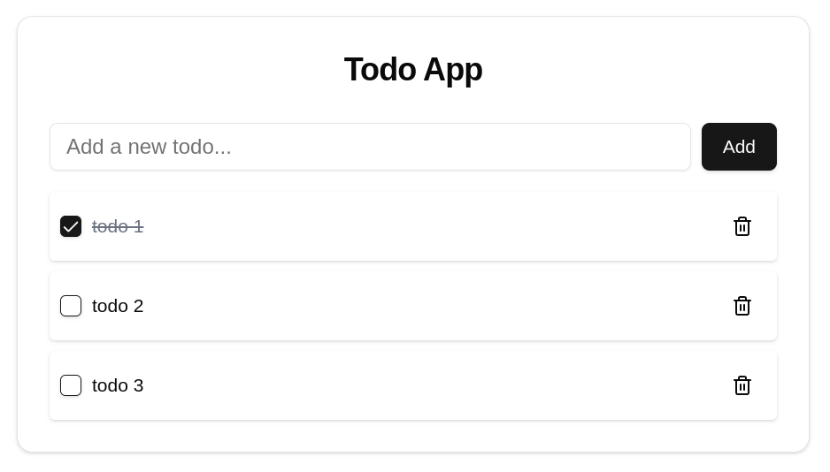

# Todo App (Next.js + Axum + Sqlite)




A full-stack Todo application built with **Next.js** for the frontend(BFF) and **Axum** for the backend. The app allows you to manage your tasks with a clean interface and seamless backend integration.

## Prerequisites

Before running the setup script, ensure that you have the following installed:

- **Node.js** (for Next.js)
- **pnpm** (for managing dependencies in the Next.js project)
- **Rust** (for the Axum backend)
- **Cargo** (for building and running the Axum project)

If you don't have these installed, please follow their official installation guides:

- [Node.js](https://nodejs.org/)
- [pnpm](https://pnpm.io/)
- [Rust](https://www.rust-lang.org/tools/install)

## Setup Instructions

1. **Clone the Repository**

   First, clone the repository to your local machine using Git:

   ```bash
   git clone https://github.com/adamDucken/todo_next_axum.git
   ```

2. **Navigate to the Project Directory**

   Change into the project directory:

   ```bash
   cd todo_next_axum
   ```

3. **Run the Setup Script**

   Make the setup script executable and run it:

   ```bash
   chmod +x setup.sh
   ./setup.sh
   ```

## What the Script Does

- **Next.js Setup**:
  - Installs dependencies using `pnpm install`
  - Builds the Next.js project using `pnpm build`

- **Axum Setup**:
  - Runs the Axum backend with the command `cargo run --release`

The setup script will guide you through each step, asking for your confirmation before executing any command.

## Troubleshooting

- If you encounter any issues with `pnpm` or `cargo` not being installed, follow the installation instructions linked in the prerequisites section.

- If the `setup.sh` script fails at any point, check the error message, ensure all prerequisites are installed, and try again.
